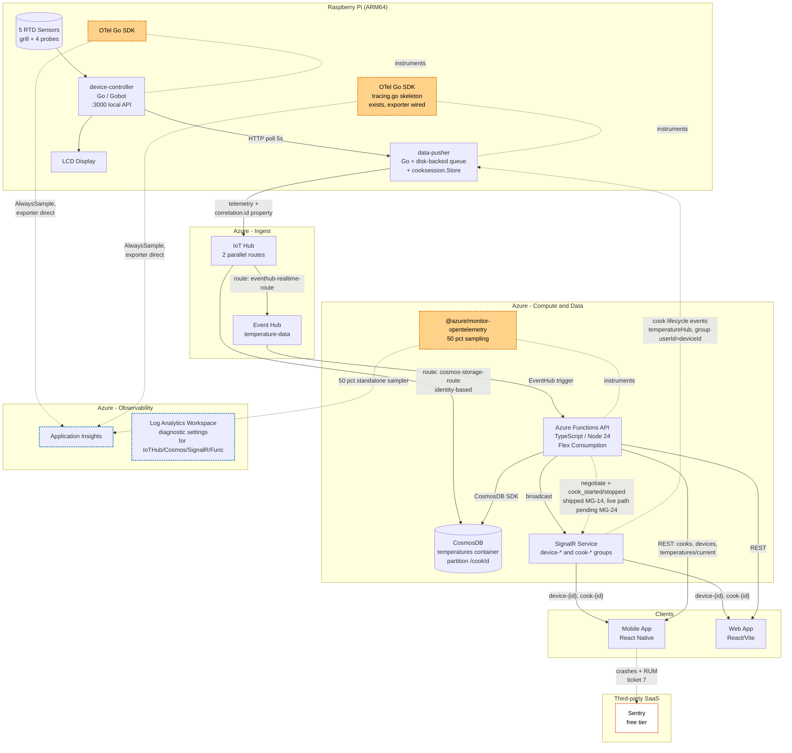
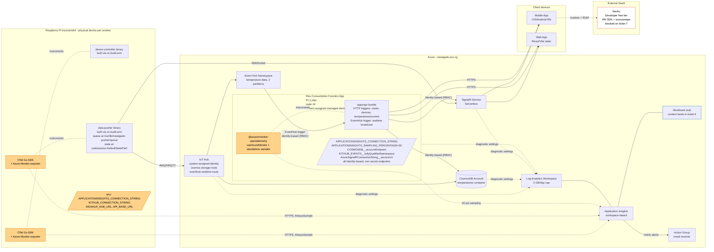
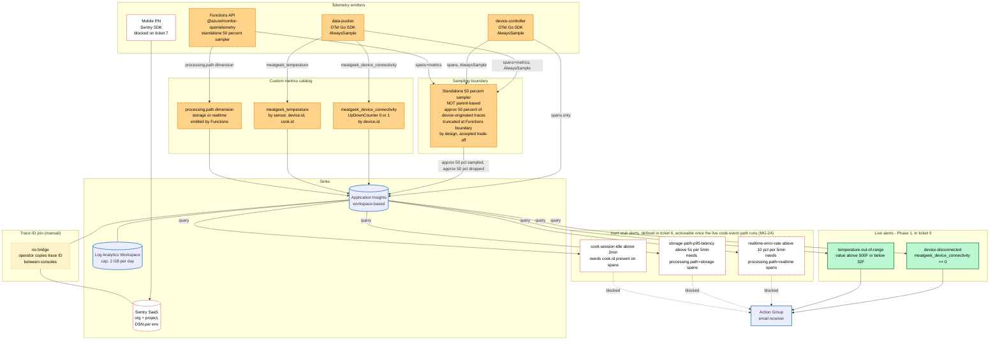

# MeatGeek V2 — Architecture Diagrams

These four diagrams capture the current state of the system **and** the
proposed additions in ticket #6 (otel-integration). Throughout, the
convention is:

- **Solid edges, default-colored nodes** → exists in the codebase today
  (committed through ticket #5).
- **Dashed edges, blue-outlined nodes (`current` class)** → exists today
  but is touched by ticket #6 (configuration change, not a new
  component).
- **Dashed edges, orange-filled nodes (`proposed` class)** → introduced
  by ticket #6.
- **Red-outlined nodes (`blocked` class)** → defined by #6 but inert
  until a separate dependency lands (e.g. the MG-24 greenfield SignalR
  Service bootstrap that makes the shipped cook-event path live, ticket
  #7 for Sentry implementation).

Each diagram has a prose legend immediately above explaining what is
new versus established.

---

## 1. System Architecture (C4 Context + Container)

**Legend.** Pi-side binaries (`device-controller`, `data-pusher`), the
Azure managed plane (IoT Hub, Event Hub, CosmosDB, SignalR, Functions),
and the clients (mobile, web) all exist today. Ticket #6 does **not**
add any new container — it adds OTel SDK instrumentation **inside** the
existing containers (shown as `OTel` sub-nodes), and a Sentry SaaS
container that the mobile app talks to directly. The shape of the
parallel storage/realtime fan-out from IoT Hub is unchanged.



---

## 2. Deployment

**Legend.** What runs where. Pi binaries are cross-compiled to ARM64
and copied to the device. Functions deploy as a Flex Consumption
app. All Azure managed services exist today (provisioned by Terraform
in `apps/infrastructure/modules/`). Ticket #6 changes **deployment
artifacts** rather than topology: the Pi binaries gain the Azure
Monitor Go exporter (dashed orange), the Functions app gains the
`@azure/monitor-opentelemetry` package, and `APPLICATIONINSIGHTS_CONNECTION_STRING`
becomes a required env var on both sides. Sentry is shown as an
external SaaS dependency that the mobile app will talk to (ticket #7,
red-outlined as blocked here).



---

## 3. Cook Lifecycle Sequence — Two Correlation Axes

**Legend.** This sequence shows a single temperature reading flowing
through the system **after** a cook has started. Two independent
correlation identifiers are emphasized:

- **`correlation.id`** (purple notes) — *cook-scoped*. Originates in
  the SignalR `CorrelationContext.id` envelope when the API publishes
  a `cook_started` event. The data-pusher captures it in
  `correlationHolder` (see `apps/data-pusher/cmd/main.go:185`) and
  stamps it on **every** outbound IoT Hub message via the
  `correlation.id` message property (constant
  `iothub.CorrelationIDPropertyName`). It is essentially constant for
  the duration of a cook. **This is unchanged by ticket #6** — the
  ticket explicitly preserves it as the cook-grouping dimension.
- **`traceparent`** (orange notes) — *per-message*, W3C Trace Context.
  Newly introduced by ticket #6. The data-pusher's OTel span context
  is serialized into the standard `traceparent` header/property on
  the IoT Hub message; the Function reads it back into the trace
  context on receive. Independent of cook scope: every published
  message gets a fresh traceparent.

The SignalR producer side (API emitting `cook_started` / `cook_stopped`)
**shipped in MG-14**: `startCook` and `stopCook` (registered in
`apps/api/src/main.ts`) emit cook-lifecycle events to the `temperatureHub`
SignalR hub, scoped to the per-device user group (`userId = deviceId`), and
the data-pusher's SignalR consumer receives them and latches the propagated
correlation id into `correlationHolder`. The **live** end-to-end path still
awaits the MG-24 greenfield SignalR Service bootstrap (AC5, see
`docs/api/signalr-cook-events-smoke.md`); until an operator runs it against
live infrastructure, `cooksession.Reconcile` against the REST API on startup
remains the practical cook-id source.

```mermaid
sequenceDiagram
    autonumber
    participant User as Mobile App
    participant API as Functions API
    participant SR as SignalR Service
    participant DP as data-pusher (Pi)
    participant DC as device-controller (Pi)
    participant IoT as IoT Hub
    participant EH as Event Hub
    participant Fn as Functions broadcast
    participant Cos as CosmosDB
    participant AI as App Insights

    rect rgba(220,38,38,0.08)
        Note over User,SR: Cook start - producer shipped (MG-14); live path pending MG-24 bootstrap
        User->>API: POST /cooks  (start cook)
        API->>Cos: insert cook doc {id=cook-abc123}
        API-->>SR: publish cook_started<br/>envelope.correlation.id = "corr-xyz"
        SR-->>DP: cook_started event<br/>{cookId, correlation.id="corr-xyz"}
        Note over DP: cooksession.Store.SetActiveCookID(cook-abc123)<br/>correlationHolder.Set("corr-xyz")
    end

    Note over DC,DP: Steady state - every 5s

    DC->>DC: poll 5 RTD sensors (10ms loop)
    DP->>DC: HTTP GET /api/.../get_temps
    DC-->>DP: 5 temps
    Note over DP: enqueuer attaches:<br/>cookId = cooksession.ActiveCookID()<br/>queueRecord.Correlation = correlationHolder.Get()

    rect rgba(255,210,138,0.35)
        Note over DP: TICKET 6: OTel Go SDK starts span iothub.publish and serializes span context to traceparent property per-message
    end

    DP->>IoT: PublishTelemetry payload + properties with messageId, correlation.id=corr-xyz, traceparent=00-traceId-spanId-01

    par Storage path
        IoT->>Cos: cosmos-storage-route<br/>(identity-based, no Function)
        Note over Cos: doc stored with cookId in body<br/>correlation.id only in IoT Hub props,<br/>not promoted into Cosmos doc today
    and Realtime path
        IoT->>EH: eventhub-realtime-route
        EH->>Fn: trigger (batch)
        rect rgba(255,210,138,0.35)
            Note over Fn: TICKET 6: useAzureMonitor() initialized, standalone 50 pct sampler, approx 50 pct of device-originated traces truncated at this boundary by design (NOT parent-based)
            Note over Fn: read traceparent, restore span context, read correlation.id property, set span attribute correlation.id
        end
        Fn->>SR: sendToGroup(device-{id}, cook-{id})<br/>'temperatureUpdate'
        SR-->>User: live temperature
    end

    Note over DP,AI: TICKET 6 - both paths emit spans with standard dimensions: device.id, cook.id, correlation.id, processing.path in storage or realtime, component, environment

    DP-->>AI: span batch (AlwaysSample)
    Fn-->>AI: span batch (50 pct sampler)
```

---

## 4. Telemetry & Observability Flow

**Legend.** Where each OTel SDK lives, what metrics each component
emits, where data flows, and which alerts are live versus inert. The
"no-bridge" boundary between Sentry and App Insights is shown
explicitly: traces are joined by **human copy-paste of the trace ID**,
not by any automatic correlation pipeline.

- **Solid blue** edges: existing telemetry flow today.
- **Dashed orange** edges/nodes: introduced by ticket #6.
- **Red-outlined** alert nodes: defined in #6 but **inert** until the
  live cook-event path runs, since 3 of them depend on the
  `processing.path` and `cook.id` dimensions only being populated once
  the realtime path actually emits spans with a cook context. The SignalR
  producer shipped in MG-14; the live path now awaits the MG-24 SignalR
  Service bootstrap (see `docs/api/signalr-cook-events-smoke.md`).
- The vertical bar labelled **"no bridge"** between App Insights and
  Sentry is intentional: ticket #6 documents that the two tools are
  **never** wired together programmatically — the user opens both
  consoles and joins by trace ID.



---

## Notes on what this document does NOT show

- **Authentication / authorization**: the Function App runs under a
  **system-assigned managed identity**. Runtime access to Cosmos, host
  Storage, the IoT-telemetry Event Hub, and SignalR is **identity-based
  (RBAC + non-secret endpoints)** — the `app_settings` in
  `apps/infrastructure/modules/functions/main.tf` carry only non-secret
  endpoint URIs (`COSMOSDB__accountEndpoint`,
  `IOTHUB_EVENTS__fullyQualifiedNamespace`,
  `AzureSignalRConnectionString__serviceUri`) resolved against that
  identity, **never** connection strings or primary keys, and no such
  secret is emitted as a Terraform output. The Flex deployment storage uses the
  same identity (`storage_authentication_type = "SystemAssignedIdentity"` on a
  `blobContainer`; shared-key access disabled).
  The single non-secret exception is Application Insights, wired via its
  telemetry `APPLICATIONINSIGHTS_CONNECTION_STRING`. App Service
  Authentication (Easy Auth) is configured **default-deny**. The diagrams
  above show logical data flows, not the full RBAC posture.
- **Cook session state recovery** detail: the SignalR producer side
  (API emitting `cook_started` / `cook_stopped`) **shipped in MG-14**, so
  the data-pusher's SignalR consumer now has a real producer. Until the
  MG-24 SignalR Service bootstrap makes the live path runnable (AC5, see
  `docs/api/signalr-cook-events-smoke.md`), `cooksession.Reconcile` against
  the REST API at startup remains the practical cook-id source. Diagram 3
  calls this out in the cook-start swimlane.
- **Mobile/Web build pipelines and Sentry sourcemap upload**: filed
  under ticket #7; out of scope for #6's diagrams beyond establishing
  the architectural boundary.
