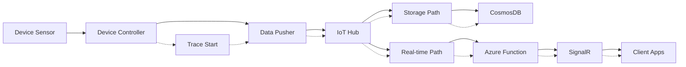

# Observability Strategy

## Overview

MeatGeek V2 implements a comprehensive observability strategy using **Azure Monitor OpenTelemetry Distribution** to provide unified monitoring, tracing, and logging across the entire system from device to client applications.

## Architecture

### **Three Pillars of Observability**

```
┌─────────────────┐    ┌─────────────────┐    ┌─────────────────┐
│     TRACES      │    │     METRICS     │    │      LOGS       │
│                 │    │                 │    │                 │
│ Request flows   │    │ Performance     │    │ Structured      │
│ Distributed     │    │ counters        │    │ events          │
│ correlation     │    │ Custom metrics  │    │ Error details   │
│ Latency         │    │ System health   │    │ Debug info      │
└─────────────────┘    └─────────────────┘    └─────────────────┘
          │                       │                       │
          └───────────────────────┼───────────────────────┘
                                  ▼
                    ┌─────────────────────────────┐
                    │    Azure Application        │
                    │        Insights            │
                    │                            │
                    │  Unified correlation and   │
                    │      analysis platform    │
                    └─────────────────────────────┘
```

### **Correlation Strategy for Parallel Architecture**

Since MeatGeek V2 uses parallel processing paths, correlation is critical:

```
Device Temperature Reading
         │
         ▼ (correlation.id: abc-123-456)
    IoT Hub Routes
         │
    ┌────┴────┐
    ▼         ▼
Storage    Real-time
Path       Path
    │         │
    ▼         ▼
CosmosDB   SignalR
    │         │
    └────┬────┘
         ▼
   Client Updates

All paths share same correlation.id for end-to-end tracing
```

## Azure Monitor OpenTelemetry Distribution

### **Why Use Azure Monitor Distribution**

Instead of generic OpenTelemetry exporters, we use Azure Monitor's distribution for:

- ✅ **Pre-configured for Azure**: Optimized batching, compression, retry logic
- ✅ **Automatic correlation**: Built-in correlation between traces, metrics, and logs
- ✅ **Native integration**: Better performance with Application Insights  
- ✅ **Less configuration**: Reduces boilerplate setup code
- ✅ **Automatic dependency tracking**: CosmosDB, Event Hub, SignalR calls traced automatically

### **Implementation by Component**

#### **Azure Functions (TypeScript)**

```typescript
// apps/api/src/shared/telemetry/setup.ts
import { useAzureMonitor } from '@azure/monitor-opentelemetry';
import { Resource } from '@opentelemetry/resources';
import { SemanticResourceAttributes } from '@opentelemetry/semantic-conventions';

export function initializeTelemetry() {
  // Use Azure Monitor OpenTelemetry Distribution
  useAzureMonitor({
    azureMonitorExporterOptions: {
      connectionString: process.env.APPLICATIONINSIGHTS_CONNECTION_STRING
    },
    resource: new Resource({
      [SemanticResourceAttributes.SERVICE_NAME]: 'meatgeek-api',
      [SemanticResourceAttributes.SERVICE_VERSION]: process.env.API_VERSION || '1.0.0',
      [SemanticResourceAttributes.DEPLOYMENT_ENVIRONMENT]: process.env.ENVIRONMENT || 'dev'
    }),
    samplingRatio: process.env.ENVIRONMENT === 'prod' ? 0.1 : 1.0,
    enableLiveMetrics: true,
    enableDependencyTracking: true,
    enablePerformanceCounters: true
  });
}
```

#### **Device Controller (Go)**

```go
// apps/device-controller/internal/telemetry/setup.go
package telemetry

import (
    "context"
    "os"
    
    "github.com/Azure/azure-sdk-for-go/sdk/monitor/azexporter"
    "go.opentelemetry.io/otel"
    "go.opentelemetry.io/otel/attribute"
    "go.opentelemetry.io/otel/sdk/resource"
    "go.opentelemetry.io/otel/sdk/trace"
    semconv "go.opentelemetry.io/otel/semconv/v1.17.0"
)

func InitializeTelemetry(deviceID string) error {
    // Azure Monitor exporter for Go
    exporter, err := azexporter.New(
        azexporter.WithConnectionString(os.Getenv("APPLICATIONINSIGHTS_CONNECTION_STRING")),
    )
    if err != nil {
        return err
    }

    // Create resource with device information
    res := resource.NewWithAttributes(
        semconv.SchemaURL,
        semconv.ServiceNameKey.String("meatgeek-device-controller"),
        semconv.ServiceVersionKey.String(os.Getenv("DEVICE_VERSION")),
        semconv.DeploymentEnvironmentKey.String(os.Getenv("ENVIRONMENT")),
        attribute.String("device.id", deviceID),
    )

    // Configure trace provider
    tp := trace.NewTracerProvider(
        trace.WithResource(res),
        trace.WithBatcher(exporter),
        trace.WithSampler(trace.AlwaysSample()), // Sample everything for device telemetry
    )

    otel.SetTracerProvider(tp)
    return nil
}
```

## Custom Dimensions Standard

### **Standard Dimensions**

All telemetry includes these consistent dimensions:

```typescript
interface StandardDimensions {
  'device.id': string;           // meatgeek3
  'cook.id'?: string;           // cook-abc-123 (if cook active)
  'user.id'?: string;           // user-456 (if authenticated)
  'environment': string;         // dev/staging/prod
  'processing.path': string;     // 'storage' | 'realtime' | 'api'
  'message.type': string;        // 'temperature' | 'cook' | 'alert'
  'correlation.id': string;      // abc-123-456 (for end-to-end correlation)
  'component': string;           // 'device' | 'iot-hub' | 'function' | 'client'
}
```

### **Implementation Example**

```typescript
// libs/tracing/src/lib/correlation-helper.ts
export class CorrelationHelper {
  // Generate correlation ID for new temperature reading
  static generateCorrelationId(deviceId: string, timestamp: Date): string {
    const ts = timestamp.getTime().toString(36);
    const random = Math.random().toString(36).substring(2, 8);
    return `${deviceId}-${ts}-${random}`;
  }

  // Add standard dimensions to all telemetry
  static getStandardDimensions(context: {
    deviceId: string;
    cookId?: string;
    userId?: string;
    processingPath: 'storage' | 'realtime' | 'api';
    messageType: string;
    correlationId: string;
    component: string;
  }): Record<string, string> {
    return {
      'device.id': context.deviceId,
      'cook.id': context.cookId || 'none',
      'user.id': context.userId || 'anonymous',
      'environment': process.env.ENVIRONMENT || 'dev',
      'processing.path': context.processingPath,
      'message.type': context.messageType,
      'correlation.id': context.correlationId,
      'component': context.component
    };
  }

  // Extract correlation ID from trace context
  static getCorrelationIdFromTrace(span: Span): string | null {
    return span.getContext().traceId || null;
  }
}
```

## Tracing Strategy

### **End-to-End Tracing Flow**



### **Trace Implementation**

#### **Device Controller Tracing**

```go
// apps/device-controller/internal/sensors/rtd.go
func (r *RTD) ReadTemperatureWithTracing(ctx context.Context) (float64, error) {
    tracer := otel.Tracer("meatgeek.device-controller")
    
    return tracer.Start(ctx, "temperature.read", func(ctx context.Context, span trace.Span) (float64, error) {
        // Add standard attributes
        span.SetAttributes(
            attribute.String("device.id", r.deviceID),
            attribute.String("sensor.type", "rtd"),
            attribute.Int("sensor.channel", r.channel),
            attribute.String("component", "device"),
        )
        
        // Read temperature
        temp, err := r.readTemperature()
        if err != nil {
            span.RecordError(err)
            span.SetStatus(codes.Error, err.Error())
            return 0, err
        }
        
        // Record temperature as metric
        span.SetAttributes(
            attribute.Float64("temperature.value", temp),
            attribute.String("temperature.unit", "fahrenheit"),
        )
        
        return temp, nil
    })
}
```

#### **Azure Functions Tracing**

```typescript
// apps/api/src/functions/temperatures/broadcast-temperature.ts
export const broadcastTemperature: EventHubHandler = async (messages, context) => {
  const tracer = trace.getTracer('meatgeek.realtime');
  
  return tracer.startActiveSpan('temperature.broadcast.batch', async (batchSpan) => {
    const dimensions = CorrelationHelper.getStandardDimensions({
      deviceId: 'batch',
      processingPath: 'realtime',
      messageType: 'temperature',
      correlationId: context.invocationId,
      component: 'function'
    });
    
    batchSpan.setAttributes(dimensions);
    batchSpan.setAttributes({
      'message.count': messages.length,
      'function.type': 'realtime'
    });

    // Process each message with individual spans
    const promises = messages.map(async (eventData, index) => {
      return tracer.startActiveSpan(`temperature.broadcast.${index}`, async (msgSpan) => {
        try {
          // Extract correlation from message
          const correlationId = eventData.properties?.['correlation.id'] || 
                               eventData.applicationProperties?.['correlation.id'];
          
          const temp = EventDataAdapter.extractTemperatureData(eventData);
          const deviceMetadata = EventDataAdapter.getDeviceMetadata(eventData);
          
          const msgDimensions = CorrelationHelper.getStandardDimensions({
            deviceId: deviceMetadata.deviceId,
            cookId: temp.cookId,
            processingPath: 'realtime',
            messageType: 'temperature',
            correlationId: correlationId || context.invocationId,
            component: 'function'
          });
          
          msgSpan.setAttributes(msgDimensions);
          msgSpan.setAttributes({
            'temperature.grill': temp.grillTemp || 0,
            'temperature.probe1': temp.probe1Temp || 0,
            'processing.latency': Date.now() - temp.timestamp.getTime()
          });

          // Broadcast with tracing
          await signalRService.sendToGroupWithTracing(
            `device-${temp.deviceId}`, 
            'temperatureUpdate', 
            temp,
            msgSpan
          );

          msgSpan.addEvent('temperature.broadcasted');
        } catch (error) {
          msgSpan.recordException(error);
          msgSpan.setStatus({ code: SpanStatusCode.ERROR });
          throw error;
        }
      });
    });

    await Promise.all(promises);
    batchSpan.setAttributes({ 'broadcast.success_count': promises.length });
  });
};
```

## Metrics Strategy

### **Custom Metrics**

```typescript
// libs/tracing/src/lib/metrics.ts
import { metrics } from '@opentelemetry/api';

export class MeatGeekMetrics {
  private static meter = metrics.getMeter('meatgeek', '1.0.0');
  
  // Temperature metrics
  static temperatureGauge = this.meter.createUpDownCounter('meatgeek_temperature', {
    description: 'Current temperature readings',
    unit: 'fahrenheit'
  });
  
  static temperatureProcessingLatency = this.meter.createHistogram('meatgeek_processing_latency', {
    description: 'Time from sensor reading to client update',
    unit: 'milliseconds'
  });
  
  static cookSessionDuration = this.meter.createHistogram('meatgeek_cook_duration', {
    description: 'Duration of cook sessions',
    unit: 'minutes'
  });
  
  static deviceConnectivity = this.meter.createUpDownCounter('meatgeek_device_connectivity', {
    description: 'Device connectivity status (1=connected, 0=disconnected)'
  });

  // Record temperature with dimensions
  static recordTemperature(temp: number, sensor: string, deviceId: string, cookId?: string) {
    this.temperatureGauge.add(temp, {
      'sensor': sensor,
      'device.id': deviceId,
      'cook.id': cookId || 'none'
    });
  }
  
  // Record processing latency
  static recordProcessingLatency(latencyMs: number, path: 'storage' | 'realtime') {
    this.temperatureProcessingLatency.record(latencyMs, {
      'processing.path': path
    });
  }
}
```

## KQL Queries for Analysis

### **End-to-End Trace Analysis**

```kql
// Trace a single temperature reading through both paths
let correlationId = "meatgeek3-abc123-456";
traces
| where customDimensions['correlation.id'] == correlationId
| project 
    timestamp,
    component = customDimensions['component'],
    processing_path = customDimensions['processing.path'],
    operation_Name,
    duration
| order by timestamp asc
| extend 
    path_latency = duration,
    total_latency = datetime_diff('millisecond', timestamp, first(timestamp))
```

### **Parallel Path Comparison**

```kql
// Compare storage vs real-time path performance
traces
| where customDimensions['message.type'] == 'temperature'
| where isnotempty(customDimensions['processing.path'])
| summarize 
    avg_latency = avg(duration),
    p95_latency = percentile(duration, 95),
    success_rate = countif(success == true) * 100.0 / count()
    by processing_path = tostring(customDimensions['processing.path'])
| order by processing_path
```

### **Cook Session Analysis**

```kql
// Analyze complete cook session traces
let cookId = "cook-abc-123";
traces
| where customDimensions['cook.id'] == cookId
| project 
    timestamp,
    component = customDimensions['component'],
    operation_Name,
    temperature_grill = todouble(customDimensions['temperature.grill']),
    duration
| order by timestamp asc
| extend cook_progress = row_number()
```

### **Device Health Monitoring**

```kql
// Monitor device connectivity and performance
customMetrics
| where name == "meatgeek_device_connectivity"
| extend device_id = tostring(customDimensions['device.id'])
| summarize 
    connectivity_score = avg(value),
    last_seen = max(timestamp)
    by device_id
| where connectivity_score < 1.0 or last_seen < ago(5m)
```

## Dashboards and Alerts

### **1. System Overview Dashboard**

**Widgets:**
- **Path Health Comparison**: Storage vs Real-time success rates
- **End-to-End Latency**: P95 latency from device to client
- **Active Cook Sessions**: Current active cooks with temperature trends
- **Device Connectivity**: Real-time device status map
- **Error Rate by Component**: Error distribution across system

**KQL Queries:**
```kql
// Real-time system health
traces
| where timestamp > ago(5m)
| summarize 
    total_requests = count(),
    error_rate = countif(success != true) * 100.0 / count(),
    avg_latency = avg(duration)
    by bin(timestamp, 1m), component = tostring(customDimensions['component'])
```

### **2. Cook Session Analytics Dashboard**

**Widgets:**
- **Active Cook Details**: Live temperature charts per cook
- **Cook History**: Completed cook summaries
- **Temperature Trends**: Historical temperature patterns
- **Cook Performance**: Average cook times by meat type
- **User Engagement**: Cook interaction metrics

**KQL Queries:**
```kql
// Cook session temperature progression
customMetrics
| where name == "meatgeek_temperature"
| where customDimensions['cook.id'] != "none"
| extend 
    cook_id = tostring(customDimensions['cook.id']),
    sensor = tostring(customDimensions['sensor'])
| summarize avg(value) by bin(timestamp, 5m), cook_id, sensor
```

### **3. Device Performance Dashboard**

**Widgets:**
- **Device Status Grid**: All devices with health status
- **Temperature Sensor Health**: Individual sensor performance
- **Message Rate**: Telemetry rate per device
- **Network Connectivity**: Connection quality metrics
- **Hardware Metrics**: CPU, memory, disk usage on Raspberry Pi

### **4. Error Correlation Dashboard**

**Widgets:**
- **Error Distribution**: Errors by component and type
- **Failed Traces**: Incomplete end-to-end traces
- **Dependency Failures**: CosmosDB, SignalR, IoT Hub failures
- **Recovery Metrics**: Auto-recovery success rates

## Alerting Strategy

### **Critical Alerts**

```kql
// Device disconnected
customMetrics
| where name == "meatgeek_device_connectivity"
| where value == 0
| where timestamp > ago(2m)
```

```kql
// High error rate in real-time path
traces
| where customDimensions['processing.path'] == "realtime"
| where timestamp > ago(5m)
| summarize error_rate = countif(success != true) * 100.0 / count()
| where error_rate > 10 // Alert if >10% error rate
```

```kql
// Temperature out of safe range
customMetrics
| where name == "meatgeek_temperature"
| where value > 500 or value < 32 // Dangerous temperatures
| where timestamp > ago(1m)
```

### **Warning Alerts**

```kql
// High latency in storage path
traces
| where customDimensions['processing.path'] == "storage"
| where duration > 5000 // >5 seconds
| where timestamp > ago(5m)
```

```kql
// Cook session without temperature updates
traces
| where customDimensions['cook.id'] != "none"
| where customDimensions['message.type'] == "temperature"
| summarize last_update = max(timestamp) by cook_id = tostring(customDimensions['cook.id'])
| where last_update < ago(2m) // No updates for 2+ minutes
```

## Benefits of This Observability Strategy

### **For Development:**
- ✅ **Complete visibility** into parallel processing paths
- ✅ **Correlation across services** for debugging
- ✅ **Performance bottleneck identification**
- ✅ **Automatic dependency tracking**

### **For Operations:**
- ✅ **Proactive alerting** on system issues
- ✅ **Device health monitoring**
- ✅ **Cook session analytics**
- ✅ **Cost optimization** through metrics analysis

### **For Users:**
- ✅ **Improved reliability** through better monitoring
- ✅ **Faster issue resolution**
- ✅ **Performance optimization**
- ✅ **Enhanced user experience**

This comprehensive observability strategy ensures that the MeatGeek V2 system is fully monitored, easily debuggable, and continuously optimized for performance and reliability.