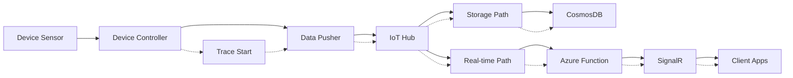

# Observability Strategy

## Overview

MeatGeek V2 uses **OpenTelemetry as the default instrumentation discipline** for everything server- and device-side, exporting to **Azure Application Insights** as the single backend for backend/device telemetry. There are exactly **two deliberate exemptions** from OTel — the two client surfaces — because each has a first-party SDK that fits its platform better than a generic OTel pipeline. The rule is: OTel unless you are one of the two named client exemptions.

## OTel with Two Exemptions

Observability in MeatGeek V2 runs in **three lanes**. Two of the three lanes are OTel-native; the client lanes are the exemptions.

| Lane | Surfaces | Instrumentation | Backend |
| --- | --- | --- | --- |
| **1. Server + Device (OTel)** | `data-pusher` (Go), `device-controller` (Go), `api` Azure Functions (TypeScript) | **OpenTelemetry** — OTel Go SDK on the two Go services; `@azure/monitor-opentelemetry` distribution on the Functions app | **Azure Application Insights** (via Azure Monitor OTel exporter) |
| **2. React web (exemption #1)** | Web dashboard (React) | **Application Insights JavaScript SDK** (`@microsoft/applicationinsights-web`) — *not* OTel | **Azure Application Insights** |
| **3. React Native (exemption #2)** | Mobile app (React Native) | **Sentry** (`@sentry/react-native`) — *not* OTel, *not* App Insights | **Sentry** |

Why the exemptions:

- **React web → App Insights JS SDK.** The App Insights JS SDK gives page-view, AJAX-dependency, and browser-exception correlation out of the box and lands in the same App Insights resource as the backend, so a web request and the Function it calls already correlate without a bridge. Wrapping the browser in generic OTel would add work and lose the first-party page instrumentation.
- **React Native → Sentry.** Mobile crash/ANR grouping, release health, and symbolicated native stack traces are Sentry's core competency and have no equivalent in App Insights. RN telemetry therefore lands in **Sentry**, a separate backend.

Lanes 1 and 2 share one Application Insights resource, so backend and web correlate natively. Lane 3 (Sentry) is a **separate backend by design** — see [Sentry vs Application Insights: Ownership Boundary](#sentry-vs-application-insights-ownership-boundary) and the [Trace-ID Copy-Paste Join Workflow](#trace-id-copy-paste-join-workflow-mobile--backend) for how mobile↔backend debugging crosses that boundary.

## MG-6 Implementation Status

MG-6 lands observability in three buckets. This section is the authoritative status; the rest of the document describes the target design, some of which is shipped and some of which is still gated.

- **Bucket A — OTel instrumentation (IMPLEMENTED).** The OTel discipline described here is shipped across `data-pusher`, `device-controller`, and the `api` Functions app, plus this document. Both Go services run an OTel `TracerProvider` with `AlwaysSample` and a swappable span exporter (a no-op exporter offline; an OTLP/HTTP exporter aimed at the App Insights ingestion endpoint when a connection string is present), and set W3C Trace Context as the global propagator. The Functions app runs the `@azure/monitor-opentelemetry` distribution with fixed-ratio 50% sampling. A W3C `traceparent` propagates `device-controller → data-pusher → IoT Hub → Functions`.
- **Bucket B — Sentry org / project architecture (PENDING operator decision).** The React Native lane's `traceparent` injection contract is designable now (see [Sentry (React Native lane)](#sentry-react-native-lane)), but the Sentry organization, project structure, and DSN specifics await an operator decision and are not yet wired.
- **Bucket C — live Azure Monitor alerts + end-to-end trace smoke + live IoT-Hub receiver (BLOCKED).** Standing up live alerts, a real end-to-end trace smoke test, and a live IoT-Hub receiver is **blocked on the MG-24 greenfield bootstrap**. The KQL, dashboard, and alert definitions below are authored against the standard dimensions but are not yet deployed against a live resource.

> **Connection-string env var is the same across runtimes.** Both the Functions app and the two Go services read the Azure-standard `APPLICATIONINSIGHTS_CONNECTION_STRING` (the Terraform-managed app setting). It is env-var only on every runtime — never hardcoded.

## Architecture

### **Three Pillars of Observability**

```
┌─────────────────┐    ┌─────────────────┐    ┌─────────────────┐
│     TRACES      │    │     METRICS     │    │      LOGS       │
│                 │    │                 │    │                 │
│ Request flows   │    │ Performance     │    │ Structured      │
│ Distributed     │    │ counters        │    │ events          │
│ correlation     │    │ Custom metrics  │    │ Error details   │
│ Latency         │    │ System health   │    │ Debug info      │
└─────────────────┘    └─────────────────┘    └─────────────────┘
          │                       │                       │
          └───────────────────────┼───────────────────────┘
                                  ▼
                    ┌─────────────────────────────┐
                    │    Azure Application        │
                    │        Insights            │
                    │                            │
                    │  Unified correlation and   │
                    │      analysis platform    │
                    └─────────────────────────────┘
```

### **Correlation Strategy for Parallel Architecture**

Since MeatGeek V2 uses parallel processing paths, correlation is critical:

```
Device Temperature Reading
         │
         ▼ (correlation.id: abc-123-456)
    IoT Hub Routes
         │
    ┌────┴────┐
    ▼         ▼
Storage    Real-time
Path       Path
    │         │
    ▼         ▼
CosmosDB   SignalR
    │         │
    └────┬────┘
         ▼
   Client Updates

All paths share same correlation.id for end-to-end tracing
```

## Azure Monitor OpenTelemetry Distribution

### **Why Use Azure Monitor Distribution**

Instead of generic OpenTelemetry exporters, we use Azure Monitor's distribution for:

- ✅ **Pre-configured for Azure**: Optimized batching, compression, retry logic
- ✅ **Automatic correlation**: Built-in correlation between traces, metrics, and logs
- ✅ **Native integration**: Better performance with Application Insights  
- ✅ **Less configuration**: Reduces boilerplate setup code
- ✅ **Automatic dependency tracking**: CosmosDB, Event Hub, SignalR calls traced automatically

### **Implementation by Component**

#### **Azure Functions (TypeScript)**

```typescript
// apps/api/src/shared/telemetry/setup.ts
import { useAzureMonitor } from '@azure/monitor-opentelemetry';
import { Resource } from '@opentelemetry/resources';
import { SemanticResourceAttributes } from '@opentelemetry/semantic-conventions';

export function initializeTelemetry() {
  // Use Azure Monitor OpenTelemetry Distribution
  useAzureMonitor({
    azureMonitorExporterOptions: {
      connectionString: process.env.APPLICATIONINSIGHTS_CONNECTION_STRING
    },
    resource: new Resource({
      [SemanticResourceAttributes.SERVICE_NAME]: 'meatgeek-api',
      [SemanticResourceAttributes.SERVICE_VERSION]: process.env.API_VERSION || '1.0.0',
      [SemanticResourceAttributes.DEPLOYMENT_ENVIRONMENT]: process.env.ENVIRONMENT || 'dev'
    }),
    // 50% trace sampling on the Functions app lives HERE, in the OTel
    // distribution, as a fixed-ratio sampler — NOT in host.json.
    samplingRatio: 0.5,
    enableLiveMetrics: true
  });
}
```

> **Where the 50% Functions sampling actually lives.** The Functions app samples at 50% via **`samplingRatio: 0.5`** in the `@azure/monitor-opentelemetry` `useAzureMonitor()` call above — a fixed-ratio OTel sampler. This is **not** configured through `host.json` adaptive sampling. The `logging.applicationInsights.samplingSettings` block in `apps/api/host.json` governs the *classic* Functions host SDK's adaptive sampling and does **not** control the OpenTelemetry distribution's trace sampler; the two are independent, and the OTel `samplingRatio` is the authoritative knob for OTel traces. The Go services (`data-pusher`, `device-controller`) use `AlwaysSample` — their telemetry volume is small enough that under-sampling would lose signal.

#### **Go services — `data-pusher` and `device-controller`**

Both Go services share one setup pattern. The canonical implementation is the tracing bootstrap at `apps/data-pusher/internal/telemetry/tracing.go`; `device-controller` mirrors it. The snippet below reflects the **shipped implementation** — an OTel `TracerProvider` with `AlwaysSample`, a swappable span exporter (a no-op exporter offline; an OTLP/HTTP exporter aimed at the App Insights ingestion endpoint when a connection string is present), and W3C Trace Context set as the global propagator so the `traceparent` injected onto IoT Hub messages flows downstream.

```go
// apps/data-pusher/internal/telemetry/tracing.go
package telemetry

import (
    "context"
    "fmt"

    "go.opentelemetry.io/otel"
    "go.opentelemetry.io/otel/exporters/otlp/otlptrace/otlptracehttp"
    "go.opentelemetry.io/otel/propagation"
    "go.opentelemetry.io/otel/sdk/resource"
    "go.opentelemetry.io/otel/sdk/trace"
    semconv "go.opentelemetry.io/otel/semconv/v1.24.0"
)

// SetupTracing initializes OpenTelemetry tracing with Azure Monitor.
func SetupTracing(ctx context.Context, appInsightsConnStr string) (func(), error) {
    res, err := resource.New(ctx,
        resource.WithAttributes(
            semconv.ServiceName("meatgeek-pusher"),
            semconv.ServiceVersion("1.0.0"),
            semconv.ServiceInstanceID("meatgeek-pusher-1"),
        ),
    )
    if err != nil {
        return nil, fmt.Errorf("failed to create resource: %w", err)
    }

    var exporter trace.SpanExporter
    if appInsightsConnStr != "" {
        // Real export path: a swappable span exporter — an OTLP/HTTP exporter
        // aimed at the App Insights ingestion endpoint parsed from the
        // connection string. The connection string is sourced from
        // APPLICATIONINSIGHTS_CONNECTION_STRING on the Go services (env var only,
        // never hardcoded). Swappable by design until the Azure Monitor Go
        // exporter is GA.
        exporter, err = otlptracehttp.New(ctx) // → App Insights ingestion endpoint
        if err != nil {
            return nil, fmt.Errorf("failed to create exporter: %w", err)
        }
    } else {
        // Dev / offline mode — no connection string, spans dropped locally.
        exporter = &noOpExporter{}
    }

    tp := trace.NewTracerProvider(
        trace.WithBatcher(exporter),
        trace.WithResource(res),
        trace.WithSampler(trace.AlwaysSample()), // volume is small; never under-sample
    )
    otel.SetTracerProvider(tp)

    // W3C Trace Context: makes the traceparent injected onto IoT Hub messages
    // interoperate with the downstream Functions / API layers.
    otel.SetTextMapPropagator(propagation.TraceContext{})

    return func() { _ = tp.Shutdown(context.Background()) }, nil
}
```

> **Status (MG-6, Bucket A — implemented):** the Go services ship an OTel `TracerProvider` with `AlwaysSample`, a swappable span exporter (no-op offline; OTLP/HTTP to the App Insights ingestion endpoint when a connection string is present), and W3C Trace Context propagation across `device-controller → data-pusher → IoT Hub`. Connection strings and endpoints are supplied **via environment variables only** — `APPLICATIONINSIGHTS_CONNECTION_STRING` on both the Go services and the Functions app — with no hardcoded values. Per-span dimensions such as `device.id` are attached on the spans (see [Tracing Strategy](#tracing-strategy)); the environment-invariant dimensions (`component`, `environment`) are also copied onto the resource.

## Custom Dimensions Standard

### **The Six Standard Dimensions (verified contract)**

Every span and metric emitted by the OTel lane (both Go services and the Functions app) carries **exactly these six** standard custom dimensions. This is the enforced contract — MG-6 AC: *"Standard custom dimensions enforced everywhere."* KQL, workbooks, and alerts are written against these keys, so they must be present and named exactly as below.

```typescript
interface StandardDimensions {
  'device.id': string;        // e.g. "meatgeek3" — physical device identity
  'cook.id': string;          // e.g. "cook-abc-123", or "none" when no cook is active
  'correlation.id': string;   // W3C-trace-derived id joining every hop of one reading
  'processing.path': string;  // 'storage' | 'realtime' | 'api'
  'component': string;        // 'device' | 'iot-hub' | 'function' | 'client'
  'environment': string;      // 'dev' | 'staging' | 'prod'
}
```

Notes on the contract:

- **`correlation.id` is trace-context-derived.** It rides device→backend as the IoT Hub message property `correlation.id` (constant `CorrelationIDPropertyName = "correlation.id"` in `apps/data-pusher/internal/iothub/client.go`) and is restored to the span dimension on the receiving Function. MG-6 tightens this from the interim UUID placeholder to **W3C Trace Context** propagation across `device-controller → data-pusher → IoT Hub → Functions → CosmosDB → SignalR`.
- **These six are the standard set — not the *only* attributes.** Individual spans still attach span-local detail (`sensor.type`, `temperature.value`, `message.type`, `message.count`, etc.). Those are useful extras but are **not** part of the enforced standard-dimension contract and must not be relied on as universally present. Earlier drafts of this doc also listed `user.id` and `message.type` as "standard" dimensions — they are **not** in the canonical six and have been demoted to optional span-local attributes.

### **Implementation Example**

```typescript
// libs/tracing/src/lib/correlation-helper.ts
export class CorrelationHelper {
  // Generate correlation ID for new temperature reading
  static generateCorrelationId(deviceId: string, timestamp: Date): string {
    const ts = timestamp.getTime().toString(36);
    const random = Math.random().toString(36).substring(2, 8);
    return `${deviceId}-${ts}-${random}`;
  }

  // Add the six standard dimensions to all telemetry
  static getStandardDimensions(context: {
    deviceId: string;
    cookId?: string;
    correlationId: string;
    processingPath: 'storage' | 'realtime' | 'api';
    component: string;
  }): Record<string, string> {
    return {
      'device.id': context.deviceId,
      'cook.id': context.cookId || 'none',
      'correlation.id': context.correlationId,
      'processing.path': context.processingPath,
      'component': context.component,
      'environment': process.env.ENVIRONMENT || 'dev'
    };
  }

  // Extract correlation ID from trace context
  static getCorrelationIdFromTrace(span: Span): string | null {
    return span.getContext().traceId || null;
  }
}
```

## Tracing Strategy

### **End-to-End Tracing Flow**



### **Trace Implementation**

#### **Device Controller Tracing**

```go
// apps/device-controller/internal/sensors/rtd.go
func (r *RTD) ReadTemperatureWithTracing(ctx context.Context) (float64, error) {
    tracer := otel.Tracer("meatgeek.device-controller")
    
    return tracer.Start(ctx, "temperature.read", func(ctx context.Context, span trace.Span) (float64, error) {
        // Add standard attributes
        span.SetAttributes(
            attribute.String("device.id", r.deviceID),
            attribute.String("sensor.type", "rtd"),
            attribute.Int("sensor.channel", r.channel),
            attribute.String("component", "device"),
        )
        
        // Read temperature
        temp, err := r.readTemperature()
        if err != nil {
            span.RecordError(err)
            span.SetStatus(codes.Error, err.Error())
            return 0, err
        }
        
        // Record temperature as metric
        span.SetAttributes(
            attribute.Float64("temperature.value", temp),
            attribute.String("temperature.unit", "fahrenheit"),
        )
        
        return temp, nil
    })
}
```

#### **Azure Functions Tracing**

```typescript
// apps/api/src/functions/temperatures/broadcast-temperature.ts
export const broadcastTemperature: EventHubHandler = async (messages, context) => {
  const tracer = trace.getTracer('meatgeek.realtime');
  
  return tracer.startActiveSpan('temperature.broadcast.batch', async (batchSpan) => {
    const dimensions = CorrelationHelper.getStandardDimensions({
      deviceId: 'batch',
      processingPath: 'realtime',
      correlationId: context.invocationId,
      component: 'function'
    });
    
    batchSpan.setAttributes(dimensions);
    batchSpan.setAttributes({
      'message.count': messages.length,
      'function.type': 'realtime'
    });

    // Process each message with individual spans
    const promises = messages.map(async (eventData, index) => {
      return tracer.startActiveSpan(`temperature.broadcast.${index}`, async (msgSpan) => {
        try {
          // Extract correlation from message
          const correlationId = eventData.properties?.['correlation.id'] || 
                               eventData.applicationProperties?.['correlation.id'];
          
          const temp = EventDataAdapter.extractTemperatureData(eventData);
          const deviceMetadata = EventDataAdapter.getDeviceMetadata(eventData);
          
          const msgDimensions = CorrelationHelper.getStandardDimensions({
            deviceId: deviceMetadata.deviceId,
            cookId: temp.cookId,
            processingPath: 'realtime',
            messageType: 'temperature',
            correlationId: correlationId || context.invocationId,
            component: 'function'
          });
          
          msgSpan.setAttributes(msgDimensions);
          msgSpan.setAttributes({
            'temperature.grill': temp.grillTemp || 0,
            'temperature.probe1': temp.probe1Temp || 0,
            'processing.latency': Date.now() - temp.timestamp.getTime()
          });

          // Broadcast with tracing
          await signalRService.sendToGroupWithTracing(
            `device-${temp.deviceId}`, 
            'temperatureUpdate', 
            temp,
            msgSpan
          );

          msgSpan.addEvent('temperature.broadcasted');
        } catch (error) {
          msgSpan.recordException(error);
          msgSpan.setStatus({ code: SpanStatusCode.ERROR });
          throw error;
        }
      });
    });

    await Promise.all(promises);
    batchSpan.setAttributes({ 'broadcast.success_count': promises.length });
  });
};
```

## Metrics Strategy

### **Custom Metrics**

```typescript
// libs/tracing/src/lib/metrics.ts
import { metrics } from '@opentelemetry/api';

export class MeatGeekMetrics {
  private static meter = metrics.getMeter('meatgeek', '1.0.0');
  
  // Temperature metrics
  static temperatureGauge = this.meter.createUpDownCounter('meatgeek_temperature', {
    description: 'Current temperature readings',
    unit: 'fahrenheit'
  });
  
  static temperatureProcessingLatency = this.meter.createHistogram('meatgeek_processing_latency', {
    description: 'Time from sensor reading to client update',
    unit: 'milliseconds'
  });
  
  static cookSessionDuration = this.meter.createHistogram('meatgeek_cook_duration', {
    description: 'Duration of cook sessions',
    unit: 'minutes'
  });
  
  static deviceConnectivity = this.meter.createUpDownCounter('meatgeek_device_connectivity', {
    description: 'Device connectivity status (1=connected, 0=disconnected)'
  });

  // Record temperature with dimensions
  static recordTemperature(temp: number, sensor: string, deviceId: string, cookId?: string) {
    this.temperatureGauge.add(temp, {
      'sensor': sensor,
      'device.id': deviceId,
      'cook.id': cookId || 'none'
    });
  }
  
  // Record processing latency
  static recordProcessingLatency(latencyMs: number, path: 'storage' | 'realtime') {
    this.temperatureProcessingLatency.record(latencyMs, {
      'processing.path': path
    });
  }
}
```

## KQL Queries for Analysis

### **End-to-End Trace Analysis**

```kql
// Trace a single temperature reading through both paths
let correlationId = "meatgeek3-abc123-456";
traces
| where customDimensions['correlation.id'] == correlationId
| project 
    timestamp,
    component = customDimensions['component'],
    processing_path = customDimensions['processing.path'],
    operation_Name,
    duration
| order by timestamp asc
| extend 
    path_latency = duration,
    total_latency = datetime_diff('millisecond', timestamp, first(timestamp))
```

### **Parallel Path Comparison**

```kql
// Compare storage vs real-time path performance
traces
| where customDimensions['message.type'] == 'temperature'
| where isnotempty(customDimensions['processing.path'])
| summarize 
    avg_latency = avg(duration),
    p95_latency = percentile(duration, 95),
    success_rate = countif(success == true) * 100.0 / count()
    by processing_path = tostring(customDimensions['processing.path'])
| order by processing_path
```

### **Cook Session Analysis**

```kql
// Analyze complete cook session traces
let cookId = "cook-abc-123";
traces
| where customDimensions['cook.id'] == cookId
| project 
    timestamp,
    component = customDimensions['component'],
    operation_Name,
    temperature_grill = todouble(customDimensions['temperature.grill']),
    duration
| order by timestamp asc
| extend cook_progress = row_number()
```

### **Device Health Monitoring**

```kql
// Monitor device connectivity and performance
customMetrics
| where name == "meatgeek_device_connectivity"
| extend device_id = tostring(customDimensions['device.id'])
| summarize 
    connectivity_score = avg(value),
    last_seen = max(timestamp)
    by device_id
| where connectivity_score < 1.0 or last_seen < ago(5m)
```

## Dashboards and Alerts

### **1. System Overview Dashboard**

**Widgets:**
- **Path Health Comparison**: Storage vs Real-time success rates
- **End-to-End Latency**: P95 latency from device to client
- **Active Cook Sessions**: Current active cooks with temperature trends
- **Device Connectivity**: Real-time device status map
- **Error Rate by Component**: Error distribution across system

**KQL Queries:**
```kql
// Real-time system health
traces
| where timestamp > ago(5m)
| summarize 
    total_requests = count(),
    error_rate = countif(success != true) * 100.0 / count(),
    avg_latency = avg(duration)
    by bin(timestamp, 1m), component = tostring(customDimensions['component'])
```

### **2. Cook Session Analytics Dashboard**

**Widgets:**
- **Active Cook Details**: Live temperature charts per cook
- **Cook History**: Completed cook summaries
- **Temperature Trends**: Historical temperature patterns
- **Cook Performance**: Average cook times by meat type
- **User Engagement**: Cook interaction metrics

**KQL Queries:**
```kql
// Cook session temperature progression
customMetrics
| where name == "meatgeek_temperature"
| where customDimensions['cook.id'] != "none"
| extend 
    cook_id = tostring(customDimensions['cook.id']),
    sensor = tostring(customDimensions['sensor'])
| summarize avg(value) by bin(timestamp, 5m), cook_id, sensor
```

### **3. Device Performance Dashboard**

**Widgets:**
- **Device Status Grid**: All devices with health status
- **Temperature Sensor Health**: Individual sensor performance
- **Message Rate**: Telemetry rate per device
- **Network Connectivity**: Connection quality metrics
- **Hardware Metrics**: CPU, memory, disk usage on Raspberry Pi

### **4. Error Correlation Dashboard**

**Widgets:**
- **Error Distribution**: Errors by component and type
- **Failed Traces**: Incomplete end-to-end traces
- **Dependency Failures**: CosmosDB, SignalR, IoT Hub failures
- **Recovery Metrics**: Auto-recovery success rates

## Alerting Strategy

### **Critical Alerts**

```kql
// Device disconnected
customMetrics
| where name == "meatgeek_device_connectivity"
| where value == 0
| where timestamp > ago(2m)
```

```kql
// High error rate in real-time path
traces
| where customDimensions['processing.path'] == "realtime"
| where timestamp > ago(5m)
| summarize error_rate = countif(success != true) * 100.0 / count()
| where error_rate > 10 // Alert if >10% error rate
```

```kql
// Temperature out of safe range
customMetrics
| where name == "meatgeek_temperature"
| where value > 500 or value < 32 // Dangerous temperatures
| where timestamp > ago(1m)
```

### **Warning Alerts**

```kql
// High latency in storage path
traces
| where customDimensions['processing.path'] == "storage"
| where duration > 5000 // >5 seconds
| where timestamp > ago(5m)
```

```kql
// Cook session without temperature updates
traces
| where customDimensions['cook.id'] != "none"
| where customDimensions['message.type'] == "temperature"
| summarize last_update = max(timestamp) by cook_id = tostring(customDimensions['cook.id'])
| where last_update < ago(2m) // No updates for 2+ minutes
```

## Sentry vs Application Insights: Ownership Boundary

Because lane 3 (React Native) reports to **Sentry** and lanes 1–2 (backend, device, web) report to **Application Insights**, there is a hard ownership boundary. Keeping it hard is a feature, not a limitation — each tool owns the signal it is best at, and neither is asked to be the other.

| Signal | Owner | Never put it in |
| --- | --- | --- |
| Backend / device errors and exceptions (Go services, Functions) | **Application Insights** | Sentry |
| Server-side traces, dependencies, metrics, correlation | **Application Insights** | Sentry |
| Web (React) page views, browser exceptions, AJAX deps | **Application Insights** (JS SDK) | Sentry |
| **Mobile (React Native) crashes, ANRs, release health, native stack traces** | **Sentry** | Application Insights |

Rules:

- **Backend errors → Application Insights. Mobile crashes → Sentry. Do not bridge them.** There is no automated forwarder that copies Sentry issues into App Insights or vice versa, and none should be built. A mobile crash is a Sentry issue; a Function throwing is an App Insights exception. Duplicating either across the boundary produces double-counted, half-correlated noise.
- The **only** sanctioned crossing of the boundary is a **human carrying a trace id** during a debugging session — see the join workflow below. That is deliberate manual correlation for a specific investigation, not a data pipeline.
- Do not point the RN app's OTel/App-Insights connection string at anything, and do not add App Insights to the mobile bundle. The mobile lane is Sentry-only.

## Trace-ID Copy-Paste Join Workflow (mobile ↔ backend)

When a bug spans the mobile app and the backend (e.g. "I hit *Start Cook* on my phone and nothing happened"), the two halves live in two different tools. You join them **manually** by carrying one id across the boundary. This works because the RN client injects a **W3C `traceparent`** on its outbound HTTP calls, and the backend OTel pipeline preserves that trace id end-to-end (see [Sentry — traceparent injection contract](#sentry-react-native-lane) below).

Step by step:

1. **Reproduce (or locate) the failing action in Sentry.** Open the Sentry issue / transaction for the mobile event. Sentry records the outbound request's trace context on the event.
2. **Copy the trace id.** From the Sentry event, copy the **trace id** (the 32-hex-char id, i.e. the middle field of the `traceparent` the client sent: `00-<trace-id>-<span-id>-01`). This is the join key.
3. **Switch to Application Insights** for the backend resource (lanes 1–2).
4. **Paste the trace id into a Transaction Search / Logs query.** The backend surfaces it as `correlation.id` (restored from the inbound trace context onto the standard span dimension), so:

   ```kql
   // Backend half of a mobile-initiated request — paste the trace id from Sentry
   let traceId = "PASTE_TRACE_ID_FROM_SENTRY";
   union traces, requests, dependencies, exceptions
   | where customDimensions['correlation.id'] == traceId
       or operation_Id == traceId
   | project timestamp, itemType, operation_Name,
             component = tostring(customDimensions['component']),
             processing_path = tostring(customDimensions['processing.path']),
             success, duration
   | order by timestamp asc
   ```

5. **Read the backend timeline.** You now see every backend hop (`device`/`function`/`iot-hub`/`client`) for that one request, including any exception, alongside the Sentry-side mobile view. The mobile symptom and the backend cause are correlated by hand, through the shared trace id.
6. **Annotate both sides.** When you resolve it, note the trace id on both the Sentry issue and the App Insights investigation so the join is reproducible. The tools stay separate; the trace id is the durable link.

> The join key is the **W3C trace id**, surfaced as `correlation.id` on the backend. It is *not* a Sentry↔App-Insights integration and requires no cross-tool credentials — just copy-paste.

## Sentry (React Native lane)

Sentry is the observability backend for the **React Native** mobile app only. It is a **Phase 1 architecture-establishment** effort under MG-6 (Sentry Developer **free tier, $0**); the client SDK **implementation** is a later phase (ticket #7). This section documents what is **designable now** — the `traceparent` injection contract that makes the mobile↔backend join above work — and explicitly fences off what requires an **operator decision**.

### Designable now — `traceparent` injection contract

This contract can and should be nailed down now, independent of Sentry org/project shape:

- **Outbound injection (client).** The RN client injects a **W3C `traceparent`** header on every outbound HTTP request to the backend, format `00-<trace-id>-<span-id>-<flags>`. Sentry's React Native tracing produces this from the active mobile transaction; the client attaches it to the API request headers (`@sentry/react-native` HTTP instrumentation / `tracePropagationTargets` scoped to the API host).
- **Backend preservation.** The Functions app runs W3C Trace Context propagation (the default OTel propagator in `@azure/monitor-opentelemetry`). It **continues** the incoming trace rather than starting a new one, so the mobile-originated `trace-id` is preserved through `Functions → CosmosDB → SignalR`. The inbound `trace-id` is restored onto the standard **`correlation.id`** span dimension (same mechanism the device→IoT-Hub path uses via the `correlation.id` message property).
- **Join semantics.** Because the client's `trace-id` is what the backend stores as `correlation.id`, the copy-paste workflow above is a direct id match — no translation table. Trace context is the contract; the two backends never talk to each other.
- **DSN management (contract, not values).** Each Sentry project/environment is addressed by a **DSN supplied via environment variable** (e.g. `SENTRY_DSN`), never hardcoded in the mobile bundle — the same env-var-only discipline the backend uses for `APPLICATIONINSIGHTS_CONNECTION_STRING`. The *number* of DSNs depends on the project-structure decision below.

### ⚠️ PENDING OPERATOR DECISION — Sentry org / project structure / DSN specifics

**Do not guess these.** The following are deliberately left unspecified until the operator chooses; MG-6 AC records this as decided "during implementation."

- **Sentry organization:** the org name / slug for the single-user free-tier org — **TBD by operator.**
- **Project structure — choose ONE model:**
  - **(a) One project + environments** — a single Sentry project with `environment` tags (`dev` / `staging` / `prod`). Fewer projects to manage; one DSN with per-environment tagging. **— or —**
  - **(b) One project per app** — a separate Sentry project per client app/surface. Cleaner per-app issue ownership and quota isolation; one DSN per project.
  - *The trade-off is issue/quota isolation (b) vs. management simplicity (a). No default is assumed here.*
- **DSN specifics:** the concrete DSN value(s) and how many exist follow directly from the model chosen above — **TBD by operator.** The *contract* (env-var-only, one DSN per project/environment addressed) is fixed; the *values and count* are not.
- **Free-tier quotas:** verify current error/transaction/replay quotas against the live Sentry pricing page at implementation time before committing to model (a) vs (b) — **operator to confirm.**

Until the operator records this decision, treat the project-structure and DSN details as **unresolved**; wire the RN SDK against a single env-var DSN placeholder and finalize once the model is chosen.

## Benefits of This Observability Strategy

### **For Development:**
- ✅ **Complete visibility** into parallel processing paths
- ✅ **Correlation across services** for debugging
- ✅ **Performance bottleneck identification**
- ✅ **Automatic dependency tracking**

### **For Operations:**
- ✅ **Proactive alerting** on system issues
- ✅ **Device health monitoring**
- ✅ **Cook session analytics**
- ✅ **Cost optimization** through metrics analysis

### **For Users:**
- ✅ **Improved reliability** through better monitoring
- ✅ **Faster issue resolution**
- ✅ **Performance optimization**
- ✅ **Enhanced user experience**

This comprehensive observability strategy ensures that the MeatGeek V2 system is fully monitored, easily debuggable, and continuously optimized for performance and reliability.